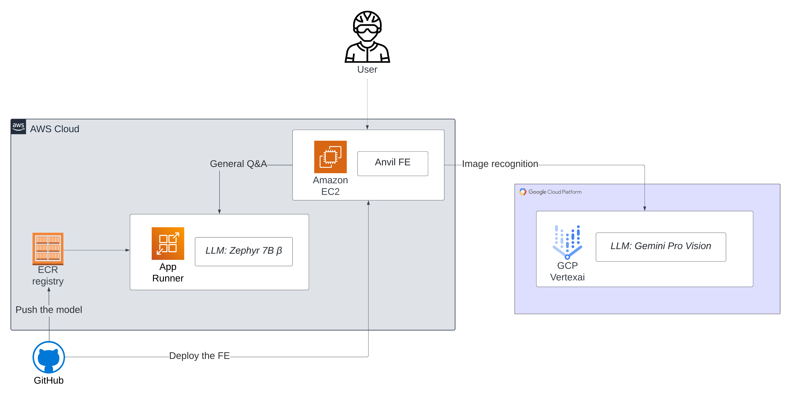

 

### `CadenceAI`: Your AI-powered cycling companion 🚴🏻‍♀🤖️🚴‍♂
Did you know there are over 1 billion bicycles in the world? The cycling industry is entirely commoditised.
However, **helpful** and **personalised** advice on training, repair and nutrition is out of reach for most people. 

Introducing - `Cadence AI`, your all-in-one AI-powered cycling coach, mechanic, analyst and dietitian. 

# MVP1
- [x] General Q&A ("How of often should I change my chain?")
- [x] Bike component identifier ("What is this part? [insert image] It's called bottom bracket!")
- [x] BE: Deploy OSS LMM Zephyr into  Cloud Run & App Runner

## Features in progress
- [ ] FE: Deploy Anvil app to Compute Engine & EC2
- [ ] Anvil BE <-> FE app with text submission and response display
- [ ] Test e2e mobile usability and get early feedback

# Contact 
You can contact me for collaborations ideas at https://glukicov.github.io/

# MVP2+ features backlog and ideas 
- [ ] Price estimation ("How much would a new chain cost for my bike?")
  - [ ] Use LangChain/agents to retrieve and show online products
- [ ] Fine-tune the OSS LMM model (improve general Q&A) 
- [ ] Use RAG with a database of common cycling questions and answers
- [ ] Caching for recently answered questions (consider safety)
- [ ] Defensive UX
- [ ] Analyse historical trends in my cycling data ("Plot of average cadence per week over the last year")
  - [ ] Use Strava API to retrieve athlete's data (one-off)
- [ ] Dashboards with all trends
  - [ ] Sync with athlete's Strava (can be a manual push/analyse request for now) 
- [ ] Cycling coach to suggest exercises to improve the trends
- [ ] Dietitian to suggest nutrition plans 
- [ ] Recommend components to upgrade or buy 
  - [ ] Add athlete's bike into profile    

# Engineering backlog
- [ ] Add [Pkl](https://pkl-lang.org/blog/introducing-pkl.html) for config validation
- [ ] Separate BE and FE in pyproject.toml
- [ ] Pass all vars (e.g. `MODEL_PATH`) to docker-compose from config.yaml
- [ ] Add HTTPS/TLS and other security layers 
- [ ] Config class 
- [ ] Linting 
- [ ] Tests (unit and e2e)
- [ ] Test coverage 
- [ ] CI/CD for deployment and testing
- [ ] Semantic versioning 
- [ ] pre-commit hooks (linting)
- [ ] API documentation (Sphinx)
- [ ] DVC for artifacts 
