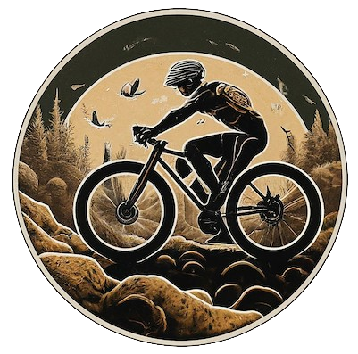

 

### 🚴‍♂️ Your all-in-one AI-powered cycling coach, mechanic, analyst and dietitian 🚴🏻‍♀️

# Contact 
You can contact me for collaborations ideas at https://glukicov.github.io/

# MVP features in progress
- [ ] Anvil BE <-> FE pretty form app with text submission and response display 
- [ ] BE: Deploy Zephyr into public Cloud Run instance with auth
- [ ] Feature 1: General Q&A ("How of often should I change my chain?")
- [ ] FE: Deploy Anvil app to Compute Engine 
- [ ] Test e2e mobile usability and get early feedback   

# Features backlog
- [ ] Multimodality. Bike component identifier (helps during repairs: "What is this part? [insert image] Oh, it's called bottom bracket!")
  - [ ] Use RAG with database of common components
- [ ] Price estimation ("How much would a new chain cost for my bike?")
  - [ ] Can use LangChain/agents to retrieve online products
- [ ] Analyse historical trends in my cycling data ("Plot of average cadence per week over the last year")
  - [ ] Use Strava data locally
  - [ ] Upload and process Stava on the cloud (GCS/Dataflow)
- [ ] Dashboards with all trends
  - [ ] Sync/hook to Strava 
- [ ] Cycling coach to suggest exercises to improve the trends
- [ ] Dietitian to suggest nutrition plans 

# Engineering backlog
- [ ] Add [Pkl](https://pkl-lang.org/blog/introducing-pkl.html) for config validation 